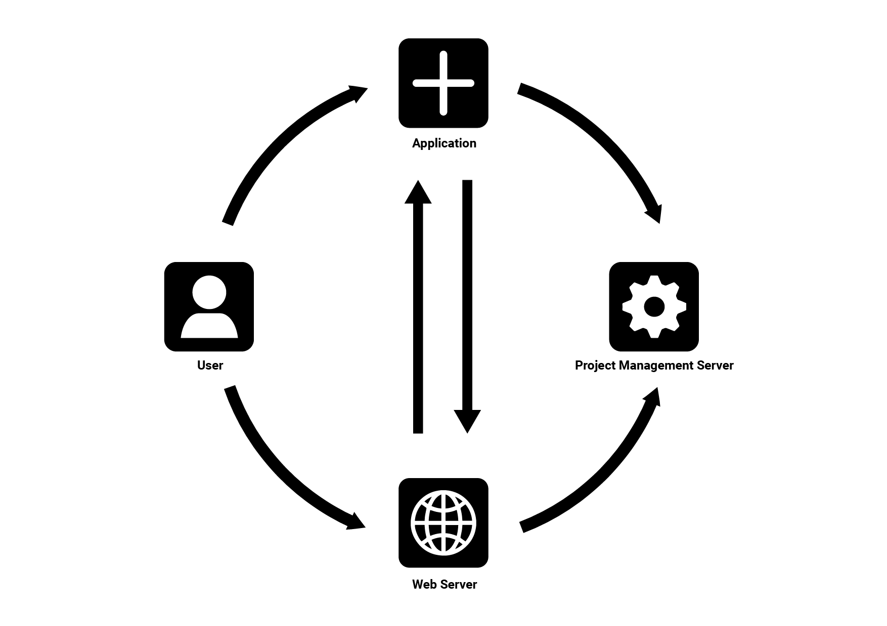

[Swagger / OpenAPI Specification](./swagger.yaml). To view an interactive version of the Swagger specification, you can go to <https://editor.swagger.io/> and pase the content from the YAML file.

> **TODO** Host the Swagger Spec directly, would improve the UX here. Maybe via GitHub pages? Or we could provide a static site.

> **TODO** Decide on whether to call it _Documents API_ or _DocumentsAPI_

# Documents API

> **TODO** Logo😀 Need to wait for bSI to either provide one or approve the proposed logo.

The Documents API is an interactive way of syncing documents between client applications and CDEs. It's specification details the _selection_ or _discovery_, _download_ and _upload_ of documents and files. When supported by both client and server, it provides an easy to use and integrated way of working on cloud stored documents from within local applications. Documents here refers to files, meaning the scope is not only limited to building models but any files.

## Contributing

The Open CDE workgroup develops the BCF standard. The group meets every second Monday at 11am CET. To join the fortnightly meeting please email [opencde@buildingsmart.org](mailto:opencde@buildingsmart.org).

# 1. Introduction

## 1.1. OpenCDE Foundation API

Documents API is a member of the OpenCDE API family. All OpenCDE APIs are united by a shared common API called [OpenCDE Foundation API](https://github.com/buildingSMART/foundation-API).  
The foundation API specifies a small number of services and a few conventions that are common to all OpenCDE APIs. All Documents API implementations must implement the Foundation API and follow its conventions and guidelines. Implementers should start by implementing the Foundation API and only then continue to implement the Documents API.

> Note: Other APIs built on top of the OpenCDE Foundation API include the [BCF API for the BIM Collaboration Format](https://github.com/buildingSMART/BCF-API).

# 2. Topology

> **TODO** Have a short paragraph describing the client-server setup / relationship and maybe also a short diagram, showing maybe files flowing (with arrows?) between these two.

# 3. Services

## 3.1. Document Selection

> **TODO** Text description, and flow sequence diagram.

### 3.1.1. Document Selection Example

> **TODO** Add examples, with requests and maybe mock up "screenshots". Maybe move examples to a different file and just link it here, to avoid cluttering.

## 3.2. Document Download

> **TODO** Text description, and flow sequence diagram.

### 3.2.1. Document Download Example

> **TODO** Add examples, with requests and maybe mock up "screenshots". Maybe move examples to a different file and just link it here, to avoid cluttering.

## 3.3. Document Upload

> **TODO** Text description, and flow sequence diagram.

### 3.3.1. Document Upload Example

> **TODO** Add examples, with requests and maybe mock up "screenshots". Maybe move examples to a different file and just link it here, to avoid cluttering.

### Multipart Upload Considerations & Implementation Notes

> **TODO** Explain why we did it the way we did it😀 Should cover: Multiple storage providers, direct upload without going through compute, upload in multiple parts due to size restrictions

# 4. Acknowledgements / History

> **TODO** Maybe list companies that contributed in the original DocumentsAPI Project in 2021/2022?
